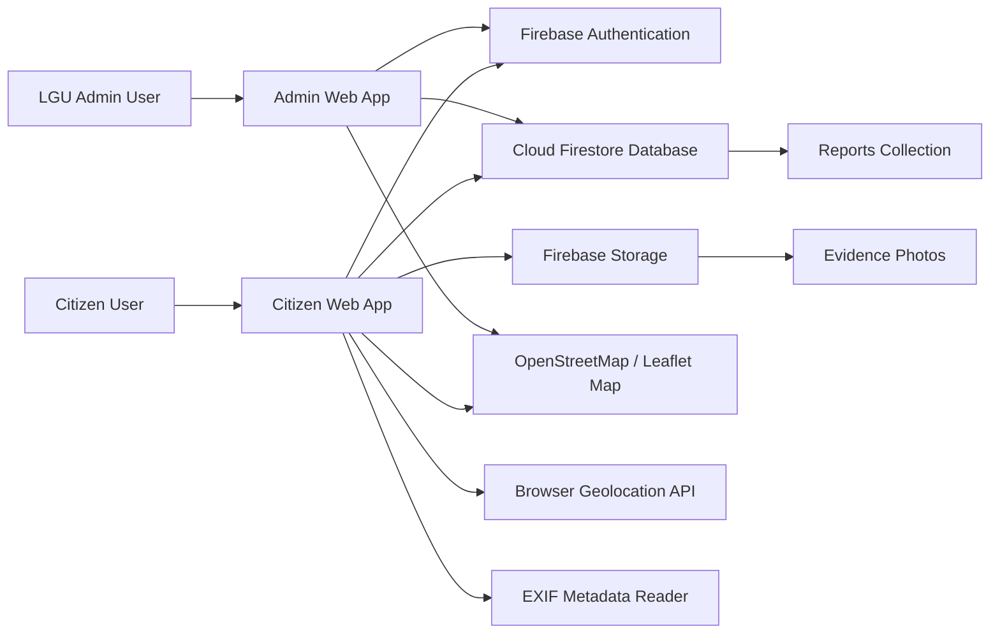
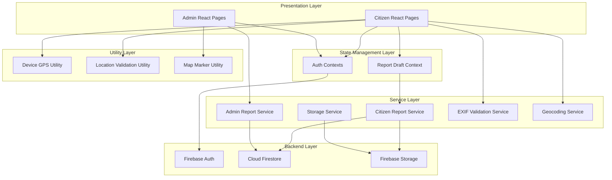
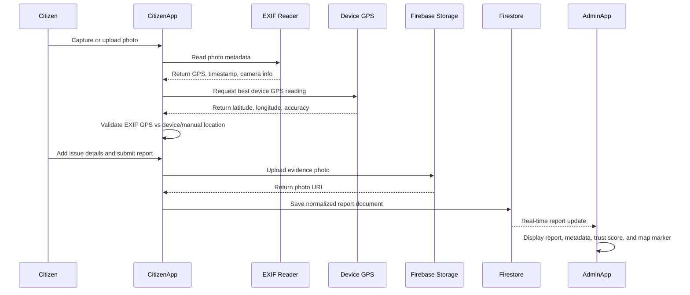
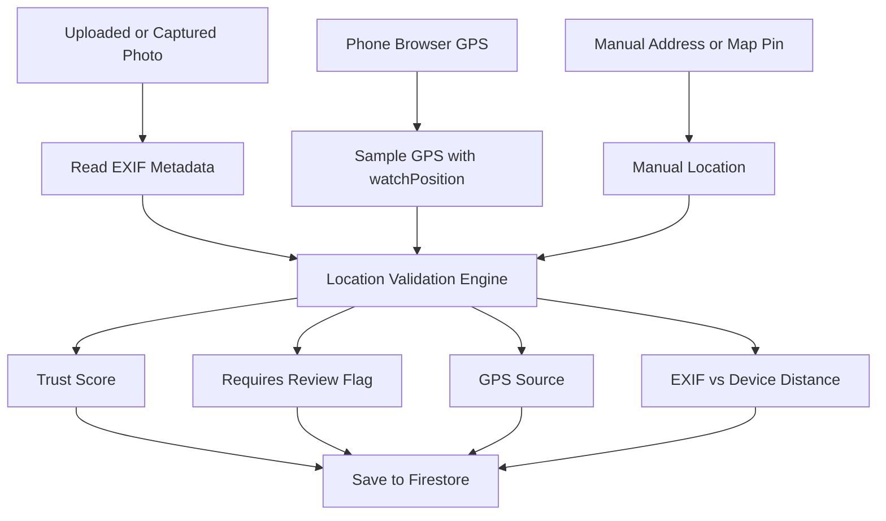
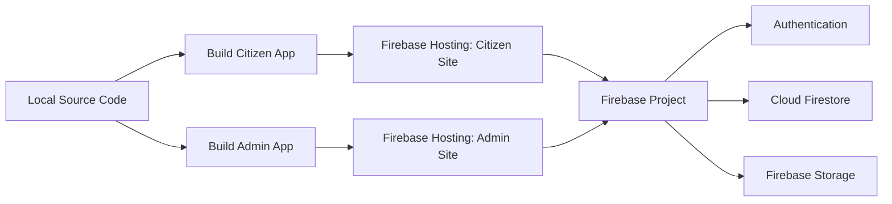

# CitizenWatch System Architecture

This document explains the CitizenWatch system architecture in a clean, defense-ready format.

## High-Level Architecture



## Simple Architecture Summary

CitizenWatch is composed of two separate React applications:

- **Citizen App**: Used by citizens to create and track infrastructure reports.
- **Admin App**: Used by LGU/admin staff to review, validate, map, and update reports.

Both apps connect to the same Firebase backend:

- **Firebase Authentication** handles user sign-in.
- **Cloud Firestore** stores report records and metadata.
- **Firebase Storage** stores uploaded report photos.
- **Leaflet/OpenStreetMap** displays report locations on maps.
- **Browser Geolocation API** captures device GPS.
- **EXIF Reader** extracts GPS and camera metadata from uploaded photos.

## Layered Architecture



## Report Submission Flow



## Citizen App Architecture

The Citizen App handles the reporting workflow.

### Main Responsibilities

- Capture or upload issue photos.
- Read EXIF metadata from the original image.
- Capture device GPS using browser geolocation.
- Allow manual address search or manual map pin placement.
- Validate location trust signals.
- Upload evidence photos to Firebase Storage.
- Save report records to Cloud Firestore.
- Let citizens track submitted reports.

### Important Citizen Files

| File | Purpose |
| --- | --- |
| `src/pages/reports/CreateReportPage.jsx` | Step 1 photo upload, preview, EXIF reading, and early GPS sampling. |
| `src/pages/reports/CreateReportLocationPage.jsx` | Step 2 location verification, device GPS, manual address, and map pin. |
| `src/pages/reports/CreateReportDetailsPage.jsx` | Step 3 report category, urgency, title, and description. |
| `src/context/ReportDraftContext.jsx` | Stores temporary report data across the multi-step form. |
| `src/services/exifValidationService.js` | Reads and normalizes EXIF metadata from photos. |
| `src/utils/deviceLocation.js` | Samples device GPS and chooses the best accuracy result. |
| `src/utils/locationValidation.js` | Compares EXIF GPS, device GPS, and manual location. |
| `src/services/reportService.js` | Uploads photo and saves final report to Firestore. |
| `src/services/storageService.js` | Handles Firebase Storage image upload and deletion. |
| `src/services/geocodingService.js` | Converts coordinates to addresses and addresses to coordinates. |

## Admin App Architecture

The Admin App handles moderation, monitoring, and report operations.

### Main Responsibilities

- Read submitted reports from Firestore in real time.
- Normalize report fields for table, map, and analytics views.
- Display trust score, GPS source, review requirement, and EXIF/device metadata.
- Allow admins to update status, progress, notes, and assigned team.
- Reject fake, not traceable, or invalid reports.
- View reports on a map and analytics dashboard.

### Important Admin Files

| File | Purpose |
| --- | --- |
| `src/services/adminReportService.js` | Main admin data service for Firestore reports and normalized metadata. |
| `src/pages/reports/ReportQueuePage.jsx` | Admin moderation table and report details panel. |
| `src/pages/reports/ReportMapPage.jsx` | Map view of submitted reports. |
| `src/pages/analytics/AnalyticsPage.jsx` | Dashboard metrics and report summaries. |
| `src/context/AdminAuthContext.jsx` | Admin authentication state and access control. |

## Data Architecture

The system uses one main Firestore collection:

```text
reports
```

Each report document contains:

| Field | Description |
| --- | --- |
| `id` | Firestore report document ID. |
| `trackingId` | Citizen-facing tracking code. |
| `issueType` / `category` | Type of infrastructure issue. |
| `title` | Report title. |
| `description` | Citizen report details. |
| `urgency` / `severity` | Issue priority level. |
| `location` | Selected report location object. |
| `latitude` / `longitude` | Main coordinates for map display. |
| `address` | Human-readable location. |
| `exif` | Summarized photo metadata. |
| `deviceLocation` | GPS captured from the phone/browser. |
| `locationValidation` | Trust score, source, distance, accuracy, and review status. |
| `photoUrl` | Firebase Storage URL of the evidence photo. |
| `status` | Current report workflow status. |
| `createdBy` | Citizen user ID. |
| `createdAt` / `updatedAt` | Report timestamps. |

## GPS And Metadata Architecture



## Location Validation Logic

The system checks multiple location signals:

- **Photo GPS** from EXIF metadata.
- **Device GPS** from the phone browser.
- **Manual location** from address search or map pin.

The validation engine computes:

- Distance between photo GPS and device GPS.
- GPS accuracy level.
- Trust score.
- GPS source.
- Whether the report requires admin review.

This design helps the city review reports more fairly because the system does not depend on only one location source.

## Deployment Architecture



## Production URLs

- Citizen App: `https://citizenwatch-citizen.web.app`
- Admin App: `https://citizenwatch-admin.web.app`

## Why This Architecture Is Good For A City Proposal

- It separates citizen reporting from admin operations.
- It stores evidence photos and report data in Firebase cloud services.
- It supports real-time admin monitoring.
- It includes GPS, EXIF, and manual location fallback.
- It flags weak or suspicious reports instead of blindly accepting them.
- It can be expanded later with SMS alerts, city department routing, and analytics.

## One-Sentence Defense Explanation

CitizenWatch uses a two-app React architecture connected to Firebase, where the citizen app captures photo and location evidence, validates it using EXIF and device GPS, stores the report in Firestore, and the admin app reviews the same data in real time through tables, maps, and analytics.
